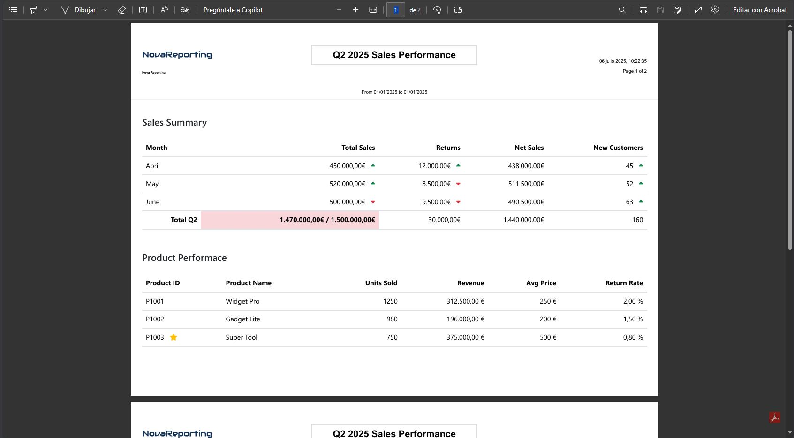
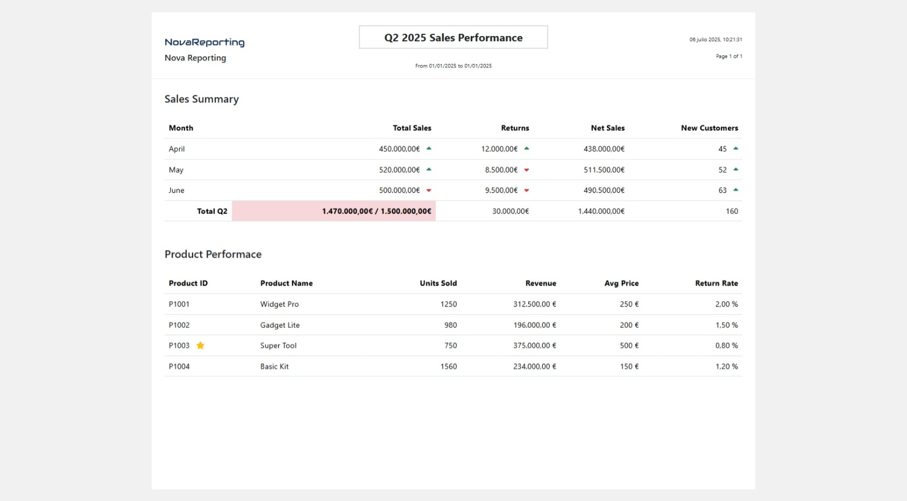

# NovaReporting

NovaReporting began as a proof of concept on my journey to move away from outdated, heavy, not cross-platform and/or often costly reporting systems like Crystal Reports or RDLs. It aims to be lightweight, cross-platform, and developer-friendly.

> 🚀 NovaReporting uses HTML + CSS to generate PDF reports — making it intuitive, flexible, and perfect for fast iterations and cross-platform environments.

Feel free to use this project as a foundation or inspiration for your own reporting solution.



## ✨ Why NovaReporting?

The core idea is to simplify report generation by using technologies most developers already know: HTML and CSS.

**Key Benefits:**

* ✅ Easy to learn – Uses standard HTML/CSS for report design.
* 🔁 Live previews – See changes immediately during development.
* 🧪 Hot reload support – Works seamlessly with Visual Studio / VS Code.
* 🎨 Style freely – Use CSS frameworks and icon libraries like Bootstrap or Font Awesome (used for the sample pdfs shown here).
* 📄 Cross-platform – Ideal for modern .NET Core web applications.



> ⚠️ Note: Most JavaScript libraries may not function as expected since scripts are often executed after DOMContentLoaded.

### 🚀 Getting Started

If you're building a .NET Core Web Application (MVC, API, Blazor, etc.), NovaReporting integrates effortlessly. You can use Razor views or any server-rendered HTML as your report source. 

You can see an example of using Razor here: [Razor Example](#razor-example)

If your project is not a .NET Web-based Application, You can also generate reports using static HTML templates, with or without a templating engine. NovaReporting just needs HTML — you're free to choose how you generate it.

You can see an example of using static HTML here: [Static HTML](#static-html-example)

For this last use-case scenario, I'm developing a static HTML Templating Engine to help you if you find it fits your needs.

### Razor Example

**Razor View:**
```

@using NovaPdf.Reporting.WebClient.Reports.Sales
@inherits BaseReportView<SalesNovaReport>

@{
    Layout = "_ReportLayout";
    SalesSummaryDS salesDS = DataSet<SalesSummaryDS>();
}

<h5>Sales Summary</h5>
<table class="table mt-4" style="font-size:0.9rem;">
    <thead>
        <tr>
            <th>Month</th>
            <th class="text-end">Total Sales</th>
            <th class="text-end">Returns</th>
            <th class="text-end">Net Sales</th>
            <th class="text-end">New Customers</th>
        </tr>
    </thead>
    <tbody>
        @{
            decimal lastTotalSales = 0;
            decimal lastReturns = 0;
            decimal lastNewCustomers = 0;
        }
        @foreach (var item in salesDS.Data)
        {
            bool upSales = item.TotalSales > lastTotalSales;
            bool upReturns = item.TotalReturns > lastReturns;
            bool upNewCustomers = item.NewCustomers > lastNewCustomers;
            lastTotalSales = item.TotalSales;
            lastReturns = item.NetSales;
            lastNewCustomers = item.NewCustomers;

            <tr>
                <td>@item.Month</td>
                <td class="text-end">
                    @item.TotalSales.ToString("N2")€
                    <i class="ms-2 fa-solid @(upSales ? "fa-caret-up text-success" : "fa-caret-down text-danger")"></i>
                </td>
                <td class="text-end">
                    @item.TotalReturns.ToString("N2")€
                    <i class="ms-2 fa-solid @(upReturns ? "fa-caret-up text-success" : "fa-caret-down text-danger")"></i>
                </td>
                <td class="text-end">@item.NetSales.ToString("N2")€</td>
                <td class="text-end">
                    @item.NewCustomers
                    <i class="ms-2 fa-solid @(upNewCustomers ? "fa-caret-up text-success" : "fa-caret-down text-danger")"></i>
                </td>
            </tr>
        }

        <tr>
            <td class="text-end fw-bold">Total Q2</td>
            <td class="text-end fw-bold @(salesDS.SumTotalSales < Parameter<decimal>("SalesTarget") ? "bg-danger" : "bg-success")" style="--bs-bg-opacity: .2;">
                @salesDS.SumTotalSales.ToString("N2")€ / @(Parameter<decimal>("SalesTarget").ToString("N2"))€
            </td>
            <td class="text-end">
                @salesDS.SumTotalReturns.ToString("N2")€
            </td>
            <td class="text-end">@salesDS.SumNetSales.ToString("N2")€</td>
            <td class="text-end">
                @salesDS.SumNewCustomers
            </td>
        </tr>
    </tbody>
</table>
```

**Controller Endpoint:**

```

[HttpPost]
[Route("sales")]
public async Task<IActionResult> DownloadSales() 
{
    SalesNovaReport report = new SalesNovaReport(HttpContext.RequestServices);

    string html = await _renderer.RenderViewToStringAsync(ControllerContext, "Sales/Report", report);

    var result = await report.GeneratePdfAsync(x =>
    {
        x.Html = html;
        x.MarginTop = 175;
    });

    if(result.IsFailure)
    {
        TempData["Error"] = result.Error;
        return View("Index");
    }

    return File(result.Value, "application/pdf", "sample.pdf");
}

```

### Static HTML Example

**HTML Template:**

```
<!DOCTYPE html>
<html lang="en">
<head>
    <meta charset="utf-8" />
    <meta name="viewport" content="width=device-width, initial-scale=1.0" />
    <link href="https://cdn.jsdelivr.net/npm/bootstrap@5.3.7/dist/css/bootstrap.min.css" rel="stylesheet" integrity="sha384-LN+7fdVzj6u52u30Kp6M/trliBMCMKTyK833zpbD+pXdCLuTusPj697FH4R/5mcr" crossorigin="anonymous">
    <link href="https://cdnjs.cloudflare.com/ajax/libs/font-awesome/6.7.2/css/all.min.css" rel="stylesheet">
</head>
<body class="p-4">
    <h5>Sales Summary</h5>
    <table class="table mt-4" style="font-size:0.9rem;">
        <thead>
            <tr>
                <th>Month</th>
                <th class="text-end">Total Sales</th>
                <th class="text-end">Returns</th>
                <th class="text-end">Net Sales</th>
                <th class="text-end">New Customers</th>
            </tr>
        </thead>
        <tbody>
            {{ SalesSummaryRows }}
        </tbody>
    </table>
</body>
</html>
```


**Controller Endpoint:**

```
[HttpPost]
[Route("static-sales")]
public async Task<IActionResult> DownloadStaticSales()
{
    SalesNovaReport salesReport = new SalesNovaReport(HttpContext.RequestServices);
        
    string currentDir = Directory.GetCurrentDirectory();
    string reportFolder = Path.Combine(currentDir, "StaticReports", salesReport.Name);

    string report = System.IO.File.ReadAllText(Path.Combine(reportFolder, "report.html"));

    string salesSumaryRowsTemplate = "";
    string saleRowTemplate = System.IO.File.ReadAllText(Path.Combine(reportFolder, "sale-row.html"));

    decimal lastTotalSales = 0;
    decimal lastReturns = 0;
    decimal lastNewCustomers = 0;
    SalesSummaryDS salesDS = salesReport.GetDataSet<SalesSummaryDS>();

    foreach (var item in salesDS.Data)
    {
        string saleRow = saleRowTemplate;
        bool upSales = item.TotalSales > lastTotalSales;
        bool upReturns = item.TotalReturns > lastReturns;
        bool upNewCustomers = item.NewCustomers > lastNewCustomers;
        lastTotalSales = item.TotalSales;
        lastReturns = item.NetSales;
        lastNewCustomers = item.NewCustomers;

        saleRow = saleRow.Replace("{{ Month }}", $"{item.Month}");
        saleRow = saleRow.Replace("{{ TotalSales }}", $"{item.TotalSales}");
        saleRow = saleRow.Replace("{{ TotalSalesIconClass }}", upSales ? "fa-caret-up text-success" : "fa-caret-down text-danger");
        saleRow = saleRow.Replace("{{ TotalReturns }}", $"{item.TotalReturns}");
        saleRow = saleRow.Replace("{{ TotalReturnsIconClass }}", upReturns ? "fa-caret-up text-success" : "fa-caret-down text-danger");
        saleRow = saleRow.Replace("{{ NetSales }}", $"{item.NetSales}");
        saleRow = saleRow.Replace("{{ NewCustomers }}", $"{item.NewCustomers}");
        saleRow = saleRow.Replace("{{ NewCustomersIconClass }}", upNewCustomers ? "fa-caret-up text-success" : "fa-caret-down text-danger");
        salesSumaryRowsTemplate += saleRow;
    }

    report = report.Replace("{{ SalesSummaryRows }}", salesSumaryRowsTemplate);

    foreach (var param in salesReport.Parameters)
        report = report.Replace($"{{{{ {param.Key} }}}}", $"{param.Value.Value}");

    var result = await salesReport.GeneratePdfAsync(x =>
    {
        x.Html = report;
        x.MarginTop = 175;
    });

    if (result.IsFailure)
    {
        TempData["Error"] = result.Error;
        return View("Index");
    }

    return File(result.Value, "application/pdf", "sample.pdf");
}
```

### 🔭 Roadmap

Here are the planned features and improvements.

**Razor**

[ X ] Templating scenarios

**Static HTML Templating Engine**

[ X ] Basic Templating scenarios

[  ] Primitive property binding support

[  ] Complex property binding support (objects)

[  ] Looping support

[  ] Conditional support

[  ] Support for filters, formatters and other pipes through simple functions

[  ] Error handling support

[  ] Template inheritance support

[  ] Partial template support

[  ] Tokenization && parsing support

[  ] Compiler / interpreter to evaluate templates

[  ] CodeDOM compilation support


### 🙏 Acknowledgements

NovaReporting is powered by:
* [Microsoft Playwright for .NET](https://github.com/microsoft/playwright-dotnet): Core component for HTML to PDF rendering.
